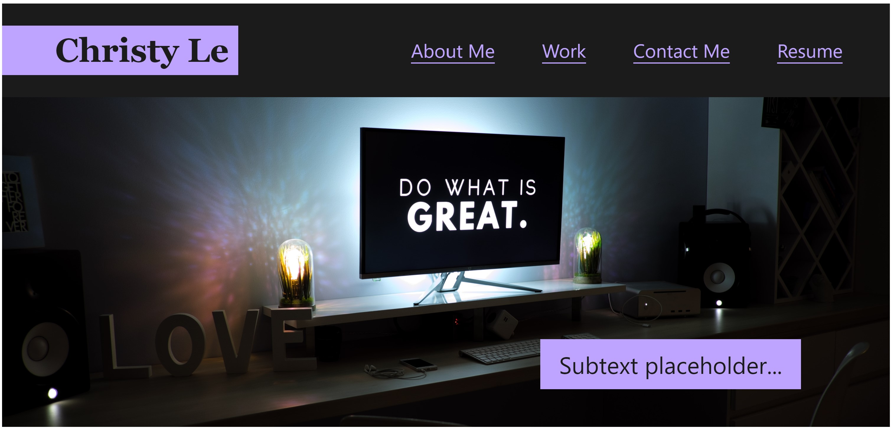

# portfolio
This is my personal portfolio website that contains information about me, my work, my contact info, and my resume.

## Installation
1. Access the repository on GitHub [here](https://github.com/christylex3/portfolio).
2. Clone it to your computer.
3. Look for the `portfolio` directory and open it.
4. Then launch the `index.html` file to see the website, which should look like [this](https://christylex3.github.io/portfolio/).

## Description
The portfolio website contains:
* a navigation bar to allow users to quickly navigate to a section (about me, work, and contact)
* a responsive layout that lets users view the website at ease on any screen and device
* a project gallery that lets users see other projects I've been working on (most current project will always be displayed the biggest)

## Usage
Freely navigate around the website by scrolling and clicking on sections to learn more about me. 

## Additional Pictures
Here's a glance of my portfolio website:

## Credits
 * [Hero image](https://unsplash.com/@martinshreder?utm_source=unsplash&utm_medium=referral&utm_content=creditCopyText) by Martin Shredder
 * [Projects' placeholder image](https://unsplash.com/@vorosbenisop?utm_source=unsplash&utm_medium=referral&utm_content=creditCopyText) by Benjamin Vorsos